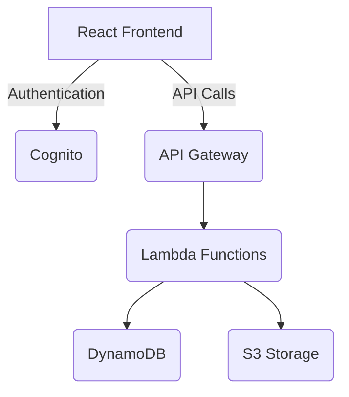

# Client Task Portal - Infrastructure Documentation

## Architecture Overview

## AWS Services Configuration

### Cognito (Authentication)

- **Free Tier**: 50,000 Monthly Active Users
- **Features**:
  - User pools for freelancers and clients
  - Secure token-based authentication
  - CloudWatch logging enabled

### DynamoDB (Database)

- **Free Tier**: 25GB Storage
- **Schema**:
  - Projects table (partition key: projectId)
  - Tasks table (partition key: taskId, sort key: projectId)

### Lambda (Backend)

- **Free Tier**: 1M Requests/month
- **Functions**:
  - Task CRUD operations
  - File upload handling
  - Authentication helpers

### S3 (File Storage)

- **Free Tier**: 5GB Storage
- **Features**:
  - Presigned URLs for secure uploads/downloads
  - Lifecycle policies for auto-cleanup

## Cost Optimization

- All services configured for Free Tier compatibility
- Usage alerts at 80% of Free Tier limits
- On-demand capacity for DynamoDB

## Development Notes

- CDK version: 2.101.0
- TypeScript implementation
- Debugging enabled for all services
